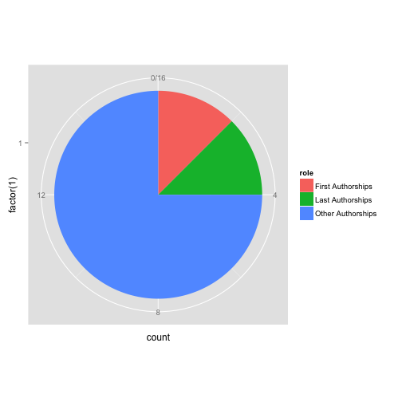
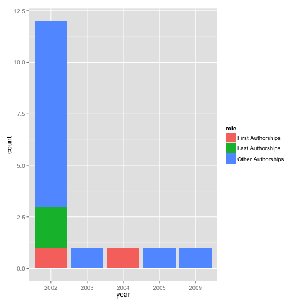

Sample Site of ````
============

Publications
-----
<!-- html table generated in R 2.15.2 by xtable 1.7-0 package -->
<!-- Fri Feb  1 02:31:35 2013 -->
<TABLE border=1>
  <TR> <TD align="right"> 1 </TD> <TD> Hepatitis B virus surface antigen levels: a guide to sustained response to peginterferon alfa-2a in HBeAg-negative chronic hepatitis B. </TD> <TD> Apr 2009 </TD> </TR>
  <TR> <TD align="right"> 2 </TD> <TD> Clinical and virological characteristics of lamivudine resistance in chronic hepatitis B patients: a single center experience. </TD> <TD> Mar 2005 </TD> </TR>
  <TR> <TD align="right"> 3 </TD> <TD> The putative recombination of hepatitis B virus genotype B with pre-C/C region of genotype C. </TD> <TD> Aug 2004 </TD> </TR>
  <TR> <TD align="right"> 4 </TD> <TD> Clinical and histological characteristics of chronic hepatitis B with negative hepatitis B e-antigen. </TD> <TD> Sep 2003 </TD> </TR>
  <TR> <TD align="right"> 5 </TD> <TD> [Effect of IFN-gamma and TNF-alpha on hepatitis B virus posttranscriptional regulatory elements]. </TD> <TD> Nov 2002 </TD> </TR>
  <TR> <TD align="right"> 6 </TD> <TD> [Clinical and histological features of fibrosing cholestatic hepatitis]. </TD> <TD> Dec 2002 </TD> </TR>
  <TR> <TD align="right"> 7 </TD> <TD> [Influence of mutation in HBV precore region on the expression of HLA-I in HepG2 cells]. </TD> <TD> Oct 2002 </TD> </TR>
  <TR> <TD align="right"> 8 </TD> <TD> Detection and significance of a G1862T variant of hepatitis B virus in Chinese patients with fulminant hepatitis. </TD> <TD> Sep 2002 </TD> </TR>
  <TR> <TD align="right"> 9 </TD> <TD> Tissue tropism of the TTV in experimentally infected rhesus monkeys. </TD> <TD> Jul 2002 </TD> </TR>
  <TR> <TD align="right"> 10 </TD> <TD> Cloning and expression and purification of hepatitis B e-antigen precursor in Escherichia coli. </TD> <TD> May 2002 </TD> </TR>
  <TR> <TD align="right"> 11 </TD> <TD> [Diagnostic value of ultrasonic examination in patients with different stages of liver fibrosis]. </TD> <TD> Apr 2002 </TD> </TR>
  <TR> <TD align="right"> 12 </TD> <TD> T helper cells in patients with chronic hepatitis B virus infection. </TD> <TD> Mar 2002 </TD> </TR>
  <TR> <TD align="right"> 13 </TD> <TD> Novel variants related to TT virus distributed widely in China. </TD> <TD> May 2002 </TD> </TR>
  <TR> <TD align="right"> 14 </TD> <TD> Novel TTV variants isolated in an epidemic of hepatitis of unknown etiology. </TD> <TD> May 2002 </TD> </TR>
  <TR> <TD align="right"> 15 </TD> <TD> [Variations of HBV can affect the reaction of specific CTL]. </TD> <TD> Feb 2002 </TD> </TR>
  <TR> <TD align="right"> 16 </TD> <TD> [Classification of genotyping hepatitis B virus with multiplex PCR]. </TD> <TD> Feb 2002 </TD> </TR>
   </TABLE>


Publication Roles
-----
 

    
Publication Roles with Year
-----
 


Locations
-------
 

